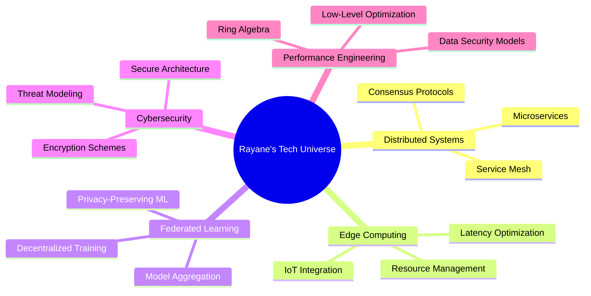

<div align="center">

<!-- Animated Header -->


</div>

<div align="center">
  
### 🚀 Building High-Performance Systems & Exploring the Future of Computing

[](https://git.io/typing-svg)

</div>

---

<div align="center">

### 📬 Let's Connect & Collaborate

[](https://www.linkedin.com/in/rayaneaboud)
[](mailto:rayane.aboud@esi.dz)
[](https://github.com/rayaneaboud)
[](https://discord.com/users/rayane)

</div>

---


## 🎯 About Me

```rust
struct Engineer {
    name: &'static str,
    role: &'static str,
    company: &'static str,
    education: &'static str,
    location: &'static str,
    interests: Vec<&'static str>,
    currently_learning: Vec<&'static str>,
}

impl Engineer {
    fn new() -> Self {
        Self {
            name: "Rayane Aboud",
            role: "Software Engineering Engineer",
            company: "Ouedkniss - Algeria's Leading Classifieds Platform",
            education: "ESI Algiers - National School of Computer Science",
            location: "Algiers, Algeria",
            interests: vec![
                "Distributed Systems",
                "Edge Computing",
                "Federated Learning",
                "Cybersecurity",
                "Low-Level Optimization"
            ],
            currently_learning: vec![
                "Ring Algebra for Encoding/Decoding",
                "Data Security Models",
                "Performance Engineering"
            ],
        }
    }
}
```


## 🛠️ Technology Arsenal

<div align="center">

### 💻 Core Languages & Frameworks

<table>
<tr>
    <td align="center" width="96">
        
        <br>Rust
    </td>
    <td align="center" width="96">
        
        <br>Go
    </td>
    <td align="center" width="96">
        
        <br>GraphQL
    </td>
    <td align="center" width="96">
        
        <br>Laravel
    </td>
    <td align="center" width="96">
        
        <br>NestJS
    </td>
    <td align="center" width="96">
        
        <br>Express
    </td>
</tr>
</table>

### 🗄️ Databases & Caching

<table>
<tr>
    <td align="center" width="96">
        
        <br>MySQL
    </td>
    <td align="center" width="96">
        
        <br>PostgreSQL
    </td>
    <td align="center" width="96">
        
        <br>Redis
    </td>
    <td align="center" width="96">
        
        <br>MongoDB
    </td>
</tr>
</table>

### 🚀 Frontend & DevOps

<table>
<tr>
    <td align="center" width="96">
        
        <br>React
    </td>
    <td align="center" width="96">
        
        <br>Vue
    </td>
    <td align="center" width="96">
        
        <br>Docker
    </td>
    <td align="center" width="96">
        
        <br>Kubernetes
    </td>
    <td align="center" width="96">
        
        <br>Git
    </td>
    <td align="center" width="96">
        
        <br>Linux
    </td>
</tr>
</table>

</div>


## 📊 GitHub Analytics

<div align="center">
  
  
</div>

<div align="center">
  
  
</div>


## 🏆 GitHub Trophies

<div align="center">
  
</div>


## 💡 Research & Interests

<div align="center">



</div>


## 🎯 Current Focus

<div align="center">

| 🔥 Domain | 📚 Learning | 🛠️ Building |
|:---:|:---:|:---:|
| **Distributed Systems** | Advanced consensus algorithms | High-throughput message queues |
| **Edge Computing** | Resource-constrained optimization | IoT data processing pipelines |
| **Federated Learning** | Privacy-preserving techniques | Decentralized ML frameworks |
| **Backend Architecture** | Ring algebra applications | Secure, scalable APIs |

</div>


<div align="center">

### 💭 Developer Quote


### 🐍 Contribution Snake


### 👀 Profile Views


</div>

---

<div align="center">


**⭐ From [rayaneaboud](https://github.com/rayaneaboud) with 💙**

</div>
